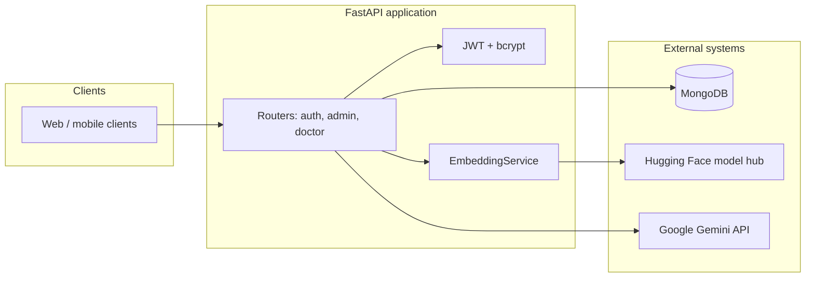

# Doctor Assistant API

Backend service for an AI-assisted clinical workflow: **FastAPI**, **MongoDB**, **biomedical transformer embeddings** for case similarity, and **Google Gemini** for natural-language synthesis in the doctor chat surface. The API separates **administrator** and **clinician** capabilities behind **JWT** bearer authentication.

> **Disclaimer:** This system is intended as **clinical decision support and research tooling**, not a regulated medical device. Model outputs and similarity scores do **not** constitute diagnoses or prescriptions. Licensed clinicians remain responsible for all patient care decisions and for verifying suggestions against institutional protocols and local regulations.

---

## Table of contents

1. [Overview](#overview)
2. [Architecture](#architecture)
3. [Requirements](#requirements)
4. [Installation](#installation)
5. [Configuration](#configuration)
6. [Running the service](#running-the-service)
7. [API surface](#api-surface)
8. [Authentication and authorization](#authentication-and-authorization)
9. [Data model](#data-model)
10. [Embeddings and assistant behavior](#embeddings-and-assistant-behavior)
11. [Security considerations](#security-considerations)
12. [Operations](#operations)
13. [Repository layout](#repository-layout)

---

## Overview

The Doctor Assistant API enables:

- **Identity and access:** Password-based login for admins (MongoDB-backed) and doctors, with JWT access tokens and role enforcement on protected routes.
- **Administration:** Bootstrap the first super-admin, provision additional admins (super-admin only), manage doctor accounts (create, list, update, block), and aggregate dashboard statistics.
- **Clinical workflow:** Doctors manage their profile, upsert patients by phone, record visits (vitals, tests, observations, medications), and list their visits with patient context.
- **Intelligent assistance:** Visit text is embedded with a biomedical vision–language BERT model; the chat endpoint retrieves similar historical visits and augments the narrative with Gemini-generated medication suggestions derived from that context.

---

## Architecture



At startup, the application connects to MongoDB (Motor async driver), ensures indexes, loads the embedding model when possible, and tears down connections on shutdown. If the embedding model fails to load, the API may still run with degraded functionality for visit embedding and chat similarity.

---

## Requirements

| Component | Notes |
|-----------|--------|
| **Python** | 3.10+ recommended (stack includes PyTorch 2.5 and Pydantic v2). |
| **MongoDB** | Compatible with MongoDB 4.x+; connection via async URI (e.g. `mongodb://` or `mongodb+srv://`). |
| **Hardware** | CPU sufficient for development; CUDA accelerates embedding inference in production. |
| **Network** | Outbound HTTPS for Hugging Face model download and Gemini API calls (chat). |

Pinned dependencies are listed in `requirements.txt`.

---

## Installation

Clone the repository and create an isolated Python environment at the repository root (there is no nested `server/` package in this layout).

```bash
git clone <repository-url>
cd <repository-directory>
python -m venv .venv
```

Activate the environment:

- **Linux / macOS:** `source .venv/bin/activate`
- **Windows (cmd):** `.venv\Scripts\activate.bat`
- **Windows (PowerShell):** `.venv\Scripts\Activate.ps1`

Install dependencies:

```bash
pip install -r requirements.txt
```

Copy the environment template and edit values (see [Configuration](#configuration)):

```bash
cp .env.example .env
```

---

## Configuration

Settings are loaded from environment variables and optional `.env` via **Pydantic Settings** (`app/config/config.py`). Use **UPPER_SNAKE_CASE** names as below.

| Variable | Required | Description |
|----------|----------|-------------|
| `MONGODB_URL` | Yes | MongoDB connection URI (e.g. `mongodb://localhost:27017` or Atlas SRV string). |
| `DATABASE_NAME` | Yes | Logical database name for this application. |
| `JWT_SECRET_KEY` | Yes | Secret used to sign JWTs; must be high-entropy in production. |
| `JWT_ALGORITHM` | Yes | Algorithm identifier passed to the JWT library (e.g. `HS256`). |
| `GIMINI_API_KEY` | Yes | API key for Google Generative AI (Gemini); used in the doctor chat flow. |
| `JWT_ACCESS_TOKEN_EXPIRE_MINUTES` | No | Token lifetime; defaults to a long-lived value in code—override explicitly for production. |
| `CORS_ORIGINS` | No | JSON-style list in env if supported by your deployment, or rely on defaults (`localhost:3000`); extend for your front-end origin. |

> **Note:** The application settings field is named `gimini_api_key` in code; the environment variable is `GIMINI_API_KEY`.

---

## Running the service

From the repository root:

```bash
python main.py
```

This binds **Uvicorn** to `0.0.0.0:8000` with reload enabled for local development.

For production-style invocation (no reload, explicit workers as needed):

```bash
uvicorn main:app --host 0.0.0.0 --port 8000
```

Interactive OpenAPI documentation:

- **Swagger UI:** `http://localhost:8000/docs`
- **ReDoc:** `http://localhost:8000/redoc`

---

## API surface

Unless noted, protected routes expect:

```http
Authorization: Bearer <access_token>
```

### Public

| Method | Path | Purpose |
|--------|------|---------|
| `GET` | `/` | Service metadata and liveness message. |
| `GET` | `/health` | Lightweight health payload for probes. |

### Authentication

| Method | Path | Purpose |
|--------|------|---------|
| `POST` | `/login` | Authenticate admin or doctor; returns JWT and user summary. |
| `POST` | `/token` | OAuth2-style alias of the login contract. |

**Request body:** JSON matching `UserLogin`: `username` (clinically this is the **phone** or login identifier stored for the user) and `password`.

### Admin (`/admin`)

All routes require an **admin** JWT.

| Method | Path | Purpose |
|--------|------|---------|
| `POST` | `/admin/setup` | One-time bootstrap of the first super-admin when no admins exist. |
| `POST` | `/admin/create` | Create an additional admin (super-admin only when admins already exist). |
| `POST` | `/admin/doctors` | Create a doctor account (bcrypt-hashed password). |
| `GET` | `/admin/doctors` | Paginated doctor directory; optional `search` on name or clinical domain; `skip` / `limit`. |
| `PATCH` | `/admin/doctors/{doctor_id}` | Partial update of doctor fields. |
| `PATCH` | `/admin/doctors/{doctor_id}/block` | Toggle blocked state for a doctor. |
| `GET` | `/admin/stats` | Aggregate counts for doctors, patients, visits, and recent visit volume. |

### Doctor (`/doctors`)

All routes require a **doctor** JWT (non-blocked account).

| Method | Path | Purpose |
|--------|------|---------|
| `GET` | `/doctors/me` | Current doctor profile (no password fields). |
| `PATCH` | `/doctors/me` | Update allowed profile fields. |
| `POST` | `/doctors/patients` | Create patient or return existing match by **phone**. |
| `POST` | `/doctors/visits` | Create visit, link patient, optionally compute and store embedding, increment doctor patient counter. |
| `GET` | `/doctors/visits` | Paginated list of the authenticated doctor’s visits with embedded patient summary. |
| `POST` | `/doctors/chat` | Natural-language query: similar-case retrieval plus Gemini-augmented narrative and medication-style suggestions. |

---

## Authentication and authorization

- **Transport:** Clients obtain a JWT from `/login` or `/token` and send it as a **Bearer** token.
- **Token claims:** Payload includes `sub` (phone) and `role` (`admin` or `doctor`).
- **Password storage:** bcrypt via Passlib.
- **Admin verification:** Admins are resolved from the `admins` collection. A **legacy hard-coded** admin pair (`admin123` / `admin123`) remains for migration scenarios; **remove or rotate** this path before any production deployment.
- **Doctor verification:** Doctors are loaded from `doctors`; blocked accounts receive `403 Forbidden`.

---

## Data model

MongoDB collections (indexes created at connection time in `app/preprocessors/database.py`):

| Collection | Purpose | Notable indexes |
|------------|---------|-----------------|
| `admins` | Admin users and super-admin flag | Unique `phone`; `isSuperAdmin` |
| `doctors` | Clinician accounts and metadata | Unique `phone`; `isBlocked` |
| `patients` | Demographics and contact | Unique `phone` |
| `visits` | Encounters, vitals, clinical text, optional `embedding` vector | `doctorId` + `date`, `patientId`, `date` |

Visit documents tie to `patientId` and `doctorId` as `ObjectId` references. Embeddings are stored on the visit when generation succeeds.

---

## Embeddings and assistant behavior

1. **Model:** `EmbeddingService` loads **`microsoft/BiomedVLP-CXR-BERT-general`** from Hugging Face (biomedical BERT family suited to clinical text). Logs may still refer generically to “Bio_ClinicalBERT” in places; the **authoritative model id** is the one in `app/embedding_service.py`.
2. **When embeddings run:** After a visit is inserted, an embedding is attempted when **`prescribedMedications`** is present; failures are logged and do not fail visit creation.
3. **Similarity:** Stored visit embeddings are compared to the query embedding (cosine similarity via scikit-learn) to rank prior cases.
4. **Chat:** The `/doctors/chat` handler aggregates visits that have embeddings, retrieves top matches, formats a structured summary, and calls **Gemini 1.5 Flash** to produce comma-separated medication-style suggestions from that context. Treat this output as **non-authoritative** and subject to clinical review.

Root-level scripts such as `genrate_embedings.py` and `query_disease.py` are standalone experiments using **Bio_ClinicalBERT** and are **not** wired into the running API’s model choice.

---

## Security considerations

- **Secrets:** Never commit `.env`; use a secret manager or encrypted CI variables in deployment.
- **JWT:** Use a strong `JWT_SECRET_KEY`, short-lived tokens in production, and HTTPS everywhere.
- **MongoDB:** Use authenticated URIs, TLS to the cluster, and least-privilege database users.
- **CORS:** Restrict `CORS_ORIGINS` to known front-end origins.
- **Gemini:** Keys grant billing access; scope keys per environment and rotate on compromise.
- **Hard-coded admin:** Eliminate the `admin123` fallback once real admins are provisioned.
- **PII:** Logs should not include full clinical narratives or tokens; align logging with HIPAA/GDPR and local policies if applicable.

---

## Operations

- **Health:** Use `GET /health` for orchestration readiness checks alongside MongoDB and optional GPU metrics from your platform.
- **Logging:** Application modules use the standard library `logging` hierarchy; tune levels per environment.
- **Model cache:** First startup may download large weights; ensure sufficient disk and stable network, or pre-populate the Hugging Face cache in your image.

---

## Repository layout

```
.
├── main.py                 # FastAPI app factory, CORS, router mount, lifespan
├── requirements.txt        # Locked Python dependencies
├── .env.example            # Environment variable template
├── seed_data.py            # Optional data seeding (see script header)
├── genrate_embedings.py    # Standalone embedding experiment
├── query_disease.py        # Standalone similarity demo
└── app/
    ├── config/
    │   └── config.py       # Pydantic settings
    ├── constants/
    ├── preprocessors/
    │   └── database.py     # Motor client, indexes, get_database
    ├── routes/
    │   ├── auth.py         # /login, /token
    │   ├── admin.py        # /admin/*
    │   └── doctor.py       # /doctors/*
    ├── auth.py             # JWT, bcrypt, dependencies
    ├── models.py           # Pydantic request/response models
    └── embedding_service.py # Transformer loading, embedding, similarity
```

---

## Contributing and support

- Prefer **small, focused changes** with clear commit messages.
- Run formatters and linters if the project adds them; keep OpenAPI behavior backward compatible unless versioning is introduced.
- For defects, include reproduction steps, request/response samples (redacted), and MongoDB / model runtime context.

For questions about deployment to cloud providers, see internal DevOps runbooks or `.cursor/rules/deployment.mdc` if used in your workspace.
